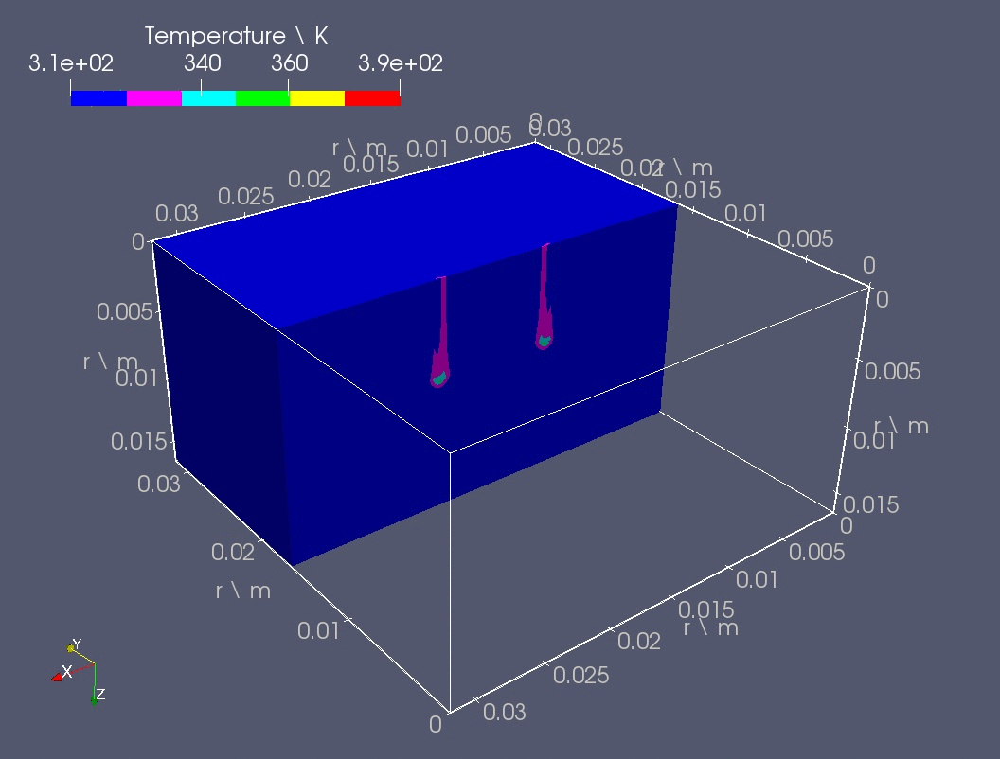
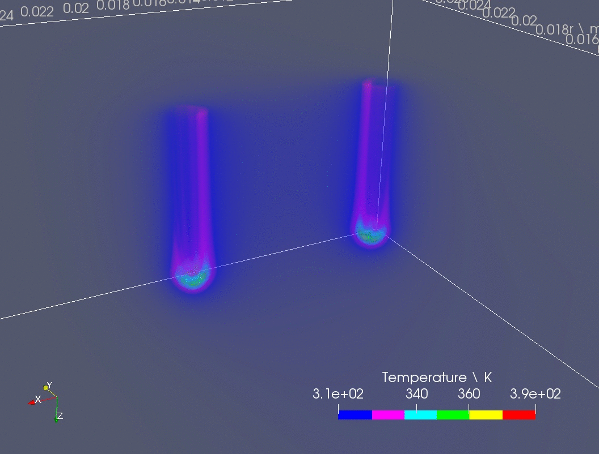
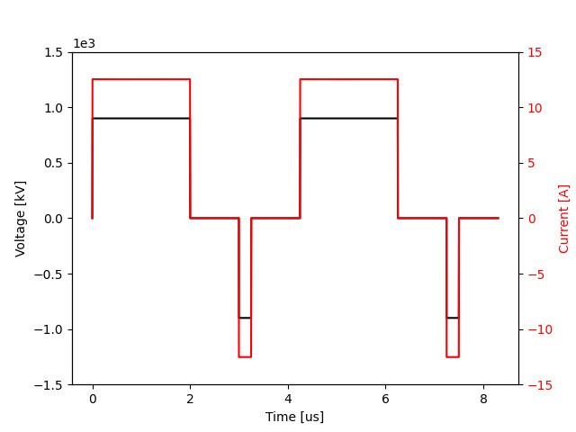

#

# OpenEP: an open source electrical-thermal simulator for electroporation-based treatments

The application of short electric pulses to biological tissues have spread across several scientific and industrial sectors, such as medical, food processing, biotechnology, and environmental science. In medicine, gene electrotransfer has proven to be a powerful method for DNA delivery. Besides, electrochemotherapy and irreversible EP have evidenced high efficacy and low side effects as antitumoral therapies, representing an alternative to traditional methods such
as surgery, radiotherapy or chemotherapy. The knowledge of key physical magnitudes involved in electroporation or pulsed electric field treatments (i.e. electric potential, electric field, electrical conductivity, current density, electric current, electric charge, electroporated area or electric field threshold variation in time, and heat distribution) is necessary to develop improved strategies to plan and optimize the application of this family of techniques. Despite the availability of several general-purpose tools that model and/or optimize EP-based therapies, currently, there are no openly-available tools specifically designed to describe the complex physical phenomena underlying EP which can also be used as a platform for therapy optimization. To address those goals, here we present OpenEP, an EP-based treatment simulator under a free/libre user license, which models EP electrical and thermal phenomena. It allows the customization of
several parameters such as types of tissue, electrode material and geometry, pulse length and frequency, number of pulses, field intensity, among many others. OpenEP solves, based on first principles, non-linear PDEs in three-dimensional space and time. It provides a highly efficient shared memory implementation which allows the analysis of complex scenarios taking advantage of parallel resources. This code was utilized in our previous works for modeling three main EP therapies: Electrochemotherapy (ECT), Irreversible Electroporation (IRE) and Gene Electro-Transfer (GET). By making this application freely available, it is expected to contribute to the EP-based treatment research as well as to promote industrial applications.

<p align="center">



</p>

If you like OpenEP, please consider starring [link](https://github.com/LSC-UBA/OpenEP "us on GitHub") and spreading the word!


# Scientific references

This code was explicitly used in the following scientific publications:

- (Under review) "OpenEP: an open source electrical-thermal simulator for electroporation-based treatments". Scientific Reports, Nature. Authors: M. Marino, E. Luján, E. Mocskos, G. Marshall. 2019.
- "Towards an optimal doseresponse relationship in gene electrotransfer protocols". Electrochimica Acta. E. Luján, M. Marino, N. Olaiz, G. Marshall. 2019.

This code implements the standard electroporation model used in scientific publications such as:

- "The Role of Additional Pulses in Electropermeabilization Protocols". Authors: C. Suárez, A. Soba, F. Maglietti, N. Olaiz, G. Marshall. 2014.
- "A Three-Dimensional In Vitro Tumor Platform for Modeling Therapeutic Irreversible Electroporation". Authors: C. B. Arena, C. S. Szot, P. A. Garcia, M. N. Rylander and R. V. Davalos. 2012.
- "Three-dimensional Finite-element Analysis of Joule Heating in Electrochemotherapy and in vivo Gene Electrotransfer". Authors: Igor Lacković, Ratko Magjarević and Damijan Miklavčič. 2009.

# Features

OpenEP provides the following features:

- It is an in-silico lab, allows modeling, planning and optimizing electroporation-based treatments, including
    - Electrochemotherapy (ECT)
    - Irreversible Electroporation (IRE)
    - Gene Electro-Transfer (GET)
- It provides support for variable-pulse protocols, including
    - Combined high-voltage (short), low-voltage (long) pulse regimens.
    - Multiple pulse trains consisting of bursts of the same (amplitude, duration, repetition rate) pulse.
- It models the dynamic of crucial physical variables involved in EP treatments
    - Electric Field, Electric Potential, Electric Current, Electric Conductivity, Current Density, Electric Charge, and Temperature.
- It models two types of electrode geometries
    - Needles, and plates (electrode length, width, thickness, anode-cathode distances, etc.)

- It models three-dimensional domains
- It runs in parallel in your notebook or in a computer cluster, using shared memory.
- Is OpenSource Software! 
   
  
# Installation instructions

To install OpenEP in GNU/Linux follow the next steps:

1. Install GCC (GNU Compiler Collection), version 7.4.0+
    - Note: to install in Ubuntu 18.04+, type in the console ```sudo apt update``` and then ```sudo apt install build-essential```
2. Download OpenEP code from [here](https://github.com/LSC-UBA/OpenEP/archive/master.zip "OpenEP code"), and uncompress the zip file.
3. Download and install Paraview following the instructions in [here](https://www.paraview.org/download/ "Paraview").


# How to setup and run your experiment

1. This code can be adapted to your specific in-silico experiment modifiyng the configuration file ```src/par.h```. Different illustrative examples can be found at ```cases/``` folder. Example of the parameters in par.h:

       Electrodes:
       - electrode_length: 0.007
       - electrode_width: 0.0007
       - electrode_thickness: 0.0007
       - gap_anode_cathode: 0.008
       - electrode_type: needles
       - gap_elect_elect: 0.005
       - no_electrodes: 1
  
       Domain dimensions:
       - x_max: 0.032
       - y_max: 0.032
       - z_max: 0.017
   
       Treatment parameters:
       - volt_to_dist: 25000
       - freq: 1
       - on_pulse_time: 0.05
       - nbr_pulses: 8
  
  2. After modifying the code (```src/par.h```), compilation and execution can be done effortlessly typing in the linux terminal: ```./run.sh```. The complete set of options of the bash script are described in the following section. The script will create a directory named ```simulation-1``` with three subdirectories in it: ```bin```, ```data``` and ```src```, which stores the simulation executable file, the output data (Paraview-compliant or csv output files) and the source code of this particular simulation, respectively. Next time the script is executed the simulation directory will be named with the following natural number with regard to the last simulation, i.e. ```simulation-2```.
  
  3. In ```simulation-1/data/``` folder you will find vtk and/or csv output files (depending on the selected configuration in ```src/par.h```). Output formats were selected to be compatible with the powerful visualization tool: Paraview. You can find tutorials about Paraview use in [here](https://www.paraview.org/tutorials/ "Paraview Tutorials").
  
  
# More about the software...

## run.sh options

| run.sh option | Description |
|---------------|---------------|
| -d <simulation-directory> | Define the simulation directory. Default: simulation-i, where i is the next number regarding to the previous simulation directory. |
| -n <number-of-threads> | Define the number of threads that will be used by the simulation. Default: number of logical cores of the computer node. |
| -c <compilation-option> | Define the compilation option (see Tab. B.4). Default: FAST OMP. |

| Compilation option | Description |
|---------------|---------------|
| STD | Standard compilation. |
| O3 | Compilation with O3 optimizations. |
| FAST | Compilation with Ofast optimizations. |
| DBG | Compilation with debug mode. |
| OMP | Compilation with OpenMP. |
| O3 OMP | Compilation with O3 optimizations and OpenMP. |
| FAST OMP | Compilation with Ofast optimizations and OpenMP. |

## Code file descriptions

| Source file |  Description  |
|---------------|---------------|
| main.cpp  |  Main simulation process is implemented in this file. | 
| electrics_calc.h, electrics_calc.cpp |  All electric variables (Phi, **E**, sigma, **j**, i, Q) are calculated in these files. Only Phi requires the solution of an equation system. | 
| temp_calc.h, temp_calc.cpp |  Temperature transient solution is solved in these files. | 
| par.h |  Biological, physical and numerical paramenters are declared and/or initialized in this file. | 
| mesh.h, mesh.cpp |   Mesh class keeps information about geometry and domain discretization. Instances of this class are used in the ScalarField class and VectorField class. | 
| scalar_field.h, scalar_field.cpp |   ScalarField class is defined in these files. Instances of this class are used in main.cpp, electrics_calc.h, temp_calc.h for depicting  Phi, |**E**|, |**j**| and sigma. | 
| vector_field.h, vector_field.cpp |   VectorField class is defined in these files. Instances of this class are used in main.cpp, electrics_calc.h and temp_calc.h for depicting **E** and **j**.  | 
| save.h, save.cpp |   Saving of the different scalar and vector fields as well as the log, are implemented in these files.| 


