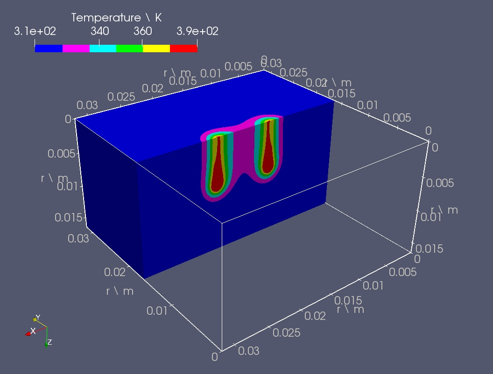
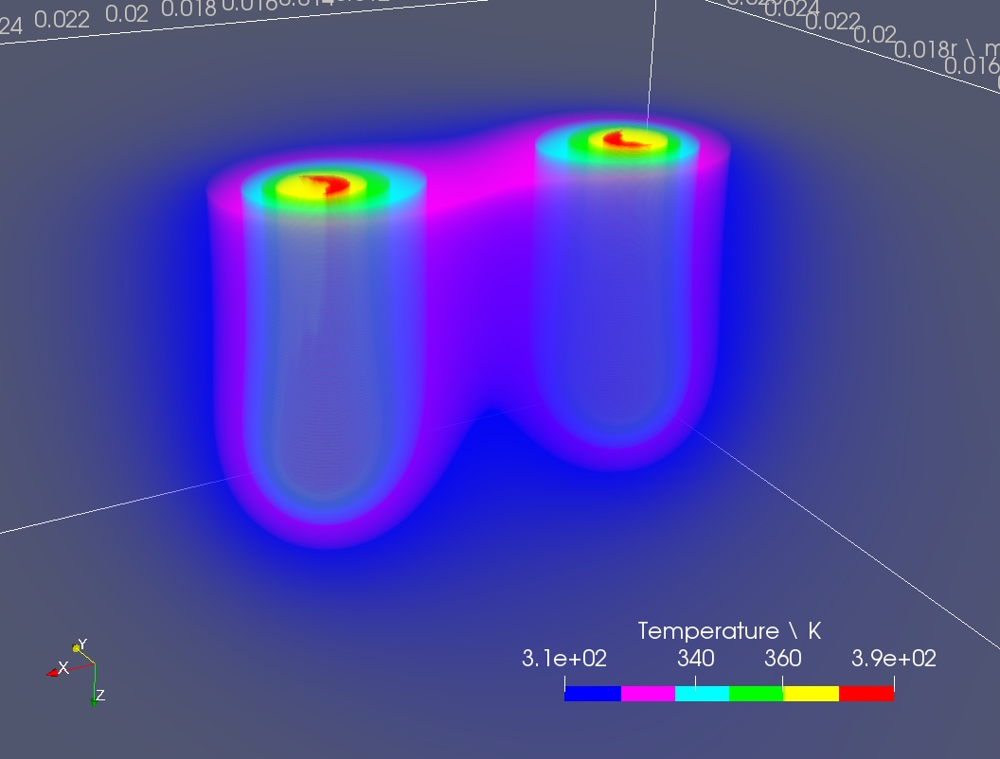

#

# OpenEP: an open source electrical-thermal simulator for electroporation-based treatments

Over more than a decade, electroporation (EP) based treatments have increased the interest of several scientific and industrial sectors, such as medical, food processing and environmental science. Computational modeling proved to be a fundamental tool for predicting, describing and optimizing these therapies. Unfortunately, there are no freely available software tools for those objectives. Here we present OpenEP, the code utilized in our previous works for modeling three main EP therapies: Electrochemotherapy (ECT), Irreversible Electroporation (IRE) and Gene Electro-Transfer (GET).
OpenEP is a general purpose electroporation-based treatment simulator under a free/libre user licence, which models the behavior of crucial physical variables involved in EP treatments: electrical and thermal. The implementation is based on a three-dimensional domain, using the finite difference method, implemented in C+ and parallelized with OpenMP over a GNU/Linux system. By making this application freely available, we expect to contribute in the fields of basic EP research as well as promote industrial applications.

# Scientific references

This code was explicitly used in the following scientific publications:

- (In preparation) "The role of damage in reversible electroporation optimization: theory and experiments in a vegetable model". Authors: M. Marino et al. 2019.
- (Under review) "OpenEP: an open source electric-thermal simulator for electroporation-based treatments". Scientific Reports, Nature. Authors: M. Marino, E. Luján, E. Mocskos, G. Marshall. 2019.
- "Towards an optimal doseresponse relationship in gene electrotransfer protocols". Electrochimica Acta. E. Luján, M. Marino, N. Olaiz, G. Marshall. 2019.

This code implements the standard electroporation model used in scientific publications such as:

- "The Role of Additional Pulses in Electropermeabilization Protocols". Authors: C. Suárez, A. Soba, F. Maglietti, N. Olaiz, G. Marshall. 2014.
- "A Three-Dimensional In Vitro Tumor Platform for Modeling Therapeutic Irreversible Electroporation". Authors: C. B. Arena, C. S. Szot, P. A. Garcia, M. N. Rylander and R. V. Davalos. 2012.
- "Three-dimensional Finite-element Analysis of Joule Heating in Electrochemotherapy and in vivo Gene Electrotransfer". Authors: Igor Lacković, Ratko Magjarević and Damijan Miklavčič. 2009.

# How to setup your experiment

This code can be adapted to your specific in-silico experiment modifiyng the configuration file par.h.
Different illustrative examples can be found at the cases folder.
Example of the parameters in par.h:

Electrodes:
  - electrode_length: 0.007
  - electrode_width: 0.0007
  - electrode_thickness: 0.0007
  - gap_anode_cathode: 0.008
  - electrode_type: needles
  - gap_elect_elect: 0.005
  - no_electrodes: 1
  
Domain dimensions:
  - x_max: 0.032
  - y_max: 0.032
  - z_max: 0.017
   
Treatment parameters:
  - volt_to_dist: 25000
  - freq: 1
  - on_pulse_time: 0.05
  - nbr_pulses: 8

# Compilation and execution instructions

After modifying the code (par.h), compilation and execution can be done effortlessly through the run.sh bash script.
The options of the script are described in the table below.
Typing in the console: run.sh will create a directory named simulation-1 with three subdirectories in it: bin, data and src, which stores the simulation executable file, the output data (Paraview-compliant or csv output files) and the source code of this particular simulation, respectively. Next time the script is executed the simulation directory will be named with the following natural number with regard to the last simulation, i.e. simulation-2.

| run.sh option | Description |
|---------------|---------------|
| -d <simulation-directory> | Define the simulation directory. Default: simulation-i, where i is the next number regarding to the previous simulation directory. |
| -n <number-of-threads> | Define the number of threads that will be used by the simulation. Default: number of logical cores of the computer node. |
| -c <compilation-option> | Define the compilation option (see Tab. B.4). Default: FAST OMP. |

| Compilation option | Description |
|---------------|---------------|
| STD | Standard compilation. |
| O3 | Compilation with O3 optimizations. |
| FAST | Compilation with Ofast optimizations. |
| DBG | Compilation with debug mode. |
| OMP | Compilation with OpenMP. |
| O3 OMP | Compilation with O3 optimizations and OpenMP. |
| FAST OMP | Compilation with Ofast optimizations and OpenMP. |

# Code file descriptions

| Source file |  Description  |
|---------------|---------------|
| main.cpp  |  Main simulation process is implemented in this file. | 
| electrics_calc.h, electrics_calc.cpp |  All electric variables (Phi, **E**, sigma, **j**, i, Q) are calculated in these files. Only Phi requires the solution of an equation system. | 
| temp_calc.h, temp_calc.cpp |  Temperature transient solution is solved in these files. | 
| par.h |  Biological, physical and numerical paramenters are declared and/or initialized in this file. | 
| mesh.h, mesh.cpp |   Mesh class keeps information about geometry and domain discretization. Instances of this class are used in the ScalarField class and VectorField class. | 
| scalar_field.h, scalar_field.cpp |   ScalarField class is defined in these files. Instances of this class are used in main.cpp, electrics_calc.h, temp_calc.h for depicting  Phi, |**E**|, |**j**| and sigma. | 
| vector_field.h, vector_field.cpp |   VectorField class is defined in these files. Instances of this class are used in main.cpp, electrics_calc.h and temp_calc.h for depicting **E** and **j**.  | 
| save.h, save.cpp |   Saving of the different scalar and vector fields as well as the log, are implemented in these files.| 

# Output

In the "data" folder you will find vtk and/or csv output files.
Each file represents the tumor concentration of a particular time.
Output formats were selected to be compatible with the powerful visualization tool: Paraview.
